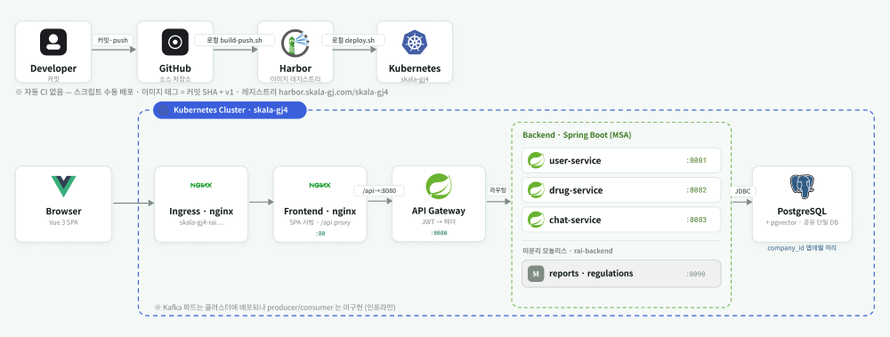
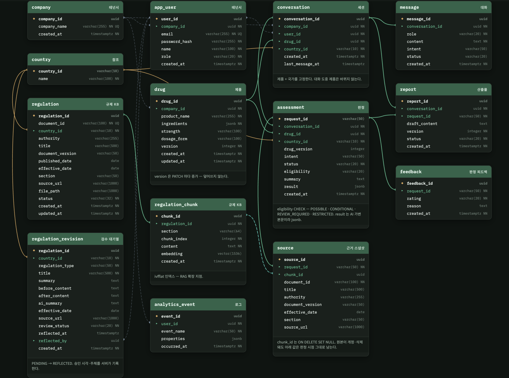
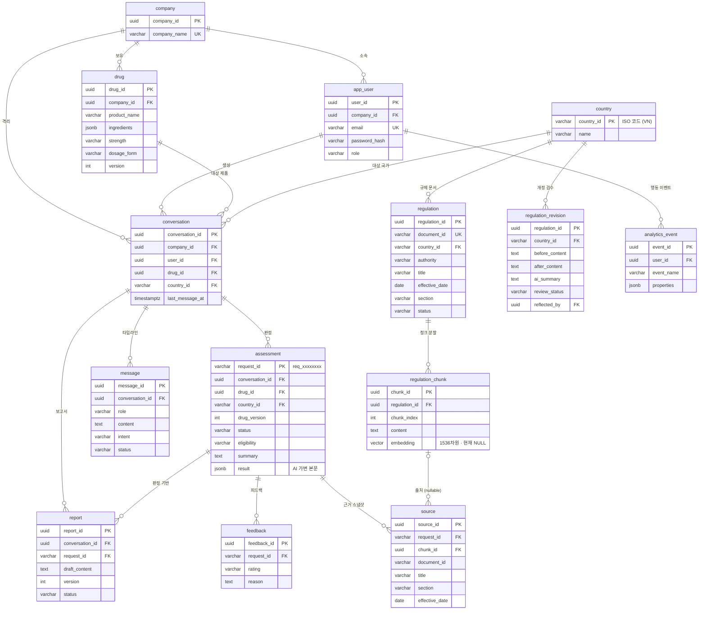

# RAI — Regulatory AI

**제약·바이오 RA(Regulatory Affairs) 담당자를 위한 수출 규제 검토 코파일럿.**
제품과 수출 대상 국가를 고정한 뒤 자연어로 질문하면, 수출 가능성 판정 → 규제 근거 확인 → 보고서 초안 작성 → PDF 내보내기까지
한 대화 안에서 처리한다.

<br>

> ### 🔗 서비스 바로가기 — **http://skala-gj4-rai.skala-gj.com**
>
> | 항목 | 내용 |
> |---|---|
> | 시연 계정 | `ra@pharm.co` / `rai1234` (한빛제약 · RA 담당자 이서연) — 회원가입으로 새 계정을 만들어도 된다 |
> | 접속 주소 | **`http`** 로 접속한다 (`https` 아님 — Ingress 에 TLS 를 두지 않았다) |
> | 배포 형태 | AWS EKS(`skala-gj4`). 프론트엔드는 **Mock API 모드**로 빌드되어 링크 하나로 국가 30개국·제품 12종·판정 4종 데이터가 바로 보인다. 백엔드 서비스 5개도 같은 도메인의 `/api` 로 함께 배포되어 있다 |
>
> ### 🎨 기획·설계 산출물
>
> | 산출물 | 링크 |
> |---|---|
> | User Flow · Wireframe (Figma) | https://www.figma.com/design/lFTaRLOnRJwuNGK4YcSn7N/RAI?node-id=0-1&t=iCtomH82Qmi2JVWK-1 |
> | REST API 명세 (화면별 17개) | [docs/api-spec/](docs/api-spec/) |
> | 시스템 아키텍처 | [docs/assets/architecture.png](docs/assets/architecture.png) · [6절](#6-시스템-아키텍처) |
> | ERD · DB 스키마 | [docs/assets/erd.png](docs/assets/erd.png) · [init-db/01_schema.sql](init-db/01_schema.sql) · [7절](#7-데이터-모델-erd) |
> | AI 프롬프트 · 입출력 규격 | [ai/prompts/](ai/prompts/) |

<br>

## 목차

1. [프로젝트 개요](#1-프로젝트-개요)
2. [팀 구성 및 역할](#2-팀-구성-및-역할)
3. [Use-Case](#3-use-case)
4. [주요 산출물](#4-주요-산출물)
5. [AI-Ready 설계 포인트](#5-ai-ready-설계-포인트)
6. [시스템 아키텍처](#6-시스템-아키텍처)
7. [데이터 모델 (ERD)](#7-데이터-모델-erd)
8. [REST API 명세 요약](#8-rest-api-명세-요약)
9. [프로젝트 구조와 FE/BE 연동](#9-프로젝트-구조와-febe-연동)
10. [실행 및 시연](#10-실행-및-시연)
11. [구현 현황 · 한계 · 향후 확장 계획](#11-구현-현황--한계--향후-확장-계획)
- [부록 A. 개발 가이드](#부록-a-개발-가이드)
- [부록 B. 배포 가이드](#부록-b-배포-가이드)

---

## 1. 프로젝트 개요

### 1-1. 한 줄 정의

> **"이 제품, 베트남에 수출할 수 있나요?"** 라는 한 문장으로 규제 판정·근거·보고서를 받는 RA 담당자용 AI-Ready 웹 서비스.

### 1-2. 기획 배경 — 해결하려는 문제

제약사가 의약품을 해외에 수출하려면 국가마다 다른 인허가 규제(성분 제한, 등록 요건, 표시 기재 사항 등)를 검토해야 한다.
이 업무를 맡는 RA 담당자는 다음과 같은 어려움을 반복적으로 겪는다.

| 문제 | 현장 상황 |
|---|---|
| **규제 원문이 흩어져 있다** | 국가별 규제 기관 사이트에 언어·형식이 제각각인 PDF 로 공개된다. 제품 하나를 검토할 때마다 처음부터 다시 찾는다 |
| **근거 없는 판단은 위험하다** | 검토 결과는 반드시 근거 조항·시행일과 함께 보고서로 남겨야 한다. 근거가 틀리면 허가 지연과 리콜 리스크로 이어진다 |
| **규제는 계속 바뀐다** | 개정 고시가 나오면 이미 검토한 제품을 다시 봐야 하지만, 어떤 제품이 영향을 받는지 추적할 수단이 없다 |
| **보고서 작성이 반복 노동이다** | 판정 내용을 다시 문서 형식으로 옮겨 적고, 수정 요청이 올 때마다 버전을 수동으로 관리한다 |

### 1-3. 프로젝트 의도

RAI 는 위 문제를 **"제품 × 국가" 컨텍스트가 고정된 대화형 워크스페이스**로 푼다.

- **검토 → 근거 → 보고서를 한 흐름으로 잇는다.** 판정 결과에는 반드시 출처(문서명·기관·조항·시행일)가 붙고, 그 판정에서 바로 보고서 초안을 만든다.
- **근거가 없으면 판정하지 않는다.** 규제 자료가 부족하면 `REVIEW_REQUIRED` 로 답하고, 문서명이나 조항을 지어내지 않는다. 이 가드레일은 화면(3R)·API·판정기 코드 세 곳에 동일하게 박혀 있다.
- **AI 는 나중에 꽂는다.** 이 프로젝트의 목표는 완성된 LLM 서비스가 아니라, **AI 가 들어올 자리를 인터페이스로 비워 둔 웹 서비스**를 설계·검증하는 것이다. 현재 판정은 규칙 기반 Mock 이 담당하며, LLM·RAG 로 교체해도 FE·API 계약·DB 스키마는 바뀌지 않는다 ([5절](#5-ai-ready-설계-포인트)).

### 1-4. 페르소나

| 항목 | 내용 |
|---|---|
| 이름 · 소속 | **이서연** · 한빛제약 RA 팀 담당자 |
| 목표 | 자사 제품의 동남아 수출 가능 여부를 빠르게 판단하고, 근거가 붙은 검토 보고서를 상급자에게 제출한다 |
| 불편 | 국가별 규제 PDF 를 일일이 찾아 읽고, 판정 근거를 손으로 정리하며, 규제가 바뀌면 처음부터 다시 검토한다 |
| 기대 | 제품과 국가만 고르면 질문 한 줄로 판정과 근거를 받고, 보고서는 대화로 다듬어 PDF 로 내보낸다 |

### 1-5. MVP 사용자 흐름

```
로그인 → 제품 선택/등록 → 국가 선택 → 채팅 질문 → 수출 가능성 판정
→ 규제 근거 확인 → 보고서 초안 생성 → 채팅으로 수정 → PDF 내보내기
```

화면 단위 흐름(17개 화면)은 [Figma](https://www.figma.com/design/lFTaRLOnRJwuNGK4YcSn7N/RAI?node-id=0-1&t=iCtomH82Qmi2JVWK-1) 와
[docs/api-spec/README.md](docs/api-spec/README.md) 의 화면 번호가 1:1 로 대응한다.

---

## 2. 팀 구성 및 역할

**TeamNoJN** (5명) · GitHub Organization [teamNoJN](https://github.com/teamNoJN)

| 이름 | 역할 (R&R) | 담당 영역 | 주요 산출물 |
|---|---|---|---|
| **이다영** | PM · Frontend Developer | 일정·진행 관리, 발표 총괄, FE 핵심 화면 | 최종 발표 자료, `frontend/` 핵심 페이지 UI |
| **노영오** | Frontend Developer · UX Designer | Use-Case 정의, User Flow·Wireframe, FE 화면 | Figma 화면 흐름도·와이어프레임, `frontend/` 공통 레이아웃·라우팅 |
| **길다인** | Backend Developer · DevOps | GitHub 레포 관리, Gateway·인증, Docker Compose·EKS 배포, E2E 연동 검증 | `backend/gateway/`, `docker-compose.yml`, `k8s/`, E2E 연동 테스트 |
| **최강희** | Backend Developer · Data Architect | 데이터 모델링(ERD), DB 스키마·시드, JPA 엔티티 | `init-db/01_schema.sql`, `init-db/02_seed.sql`, ERD |
| **유재권** | Backend Developer · API Architect | REST API 명세, 서비스 간 계약(`common/`), AI 프롬프트·입출력 JSON 규격 | `docs/api-spec/` (17개), `backend/common/`, `ai/prompts/` |

세 명의 백엔드 개발자는 위 역할과 함께 서비스를 나눠 맡았다(user · drug · chat · backend 모놀리스).
`frontend/` 는 프론트엔드 담당자 전용 영역이며 백엔드 작업자는 수정하지 않는 것을 규칙으로 두었다.

---

## 3. Use-Case

### 3-1. Actor

| Actor | 설명 |
|---|---|
| **RA 담당자** (핵심) | 로그인한 회사 소속 사용자. 제품을 등록하고 국가별 수출 가능성을 검토하며 보고서를 만든다 |
| **규제 검수자** | 동일한 회사 사용자가 겸한다(B2B — 전원 검수 권한). 개정 규제를 확인하고 지식베이스 반영을 승인한다 |
| **운영자** | 규제 원문 PDF 를 메타데이터와 함께 지식베이스에 적재한다 (API 로 수행, 화면 없음) |
| **AI 판정 엔진** (시스템) | 제품·국가·근거를 받아 구조화된 판정 JSON 을 돌려준다. 현재는 규칙 기반 Mock, 향후 LLM |

### 3-2. Use-Case 목록

| # | Use-Case | Actor | 화면 | AI 확장 지점 |
|---|---|---|---|---|
| UC-01 | 회원가입·로그인 (회사명 기준 자동 소속) | RA 담당자 | 1, 1E | |
| UC-02 | 제품 등록·검색 (성분·함량·제형) | RA 담당자 | 2, 2F, 2S | |
| UC-03 | 대상 국가 선택 후 대화 세션 생성 (규제 문서가 있는 국가만 선택 가능) | RA 담당자 | 2, 3C | |
| UC-04 | **수출 가능성 판정 질의** — 비동기 접수(202) 후 폴링으로 판정 카드 수신 | RA 담당자 · AI 판정 엔진 | 3, 3E, 3R | ① `Assessor` |
| UC-05 | 판정 근거 확인 — 성분별 판정·요건·리스크·출처 문서 | RA 담당자 | 4 | ② `RegulationRetriever` |
| UC-06 | 판정 피드백 (유용 / 수정 필요) | RA 담당자 | 3 | |
| UC-07 | **보고서 초안 생성 → 대화로 수정(버전 +1) → PDF 내보내기** | RA 담당자 · AI 판정 엔진 | 5, 5L | ③ `ReportDrafter` |
| UC-08 | 규제 변경 검수·승인 (승인자·시각 감사 기록) | 규제 검수자 | 6 | |
| UC-09 | 규제 문서 적재 — PDF 텍스트 추출 → 청크 분할 → 저장 | 운영자 | — | ② (임베딩·벡터 검색) |
| UC-10 | 제품 성분 변경 시 "재검토 필요" 표시 | RA 담당자 | 2N, P | *(Post-MVP)* |

### 3-3. 핵심 시나리오 — UC-04 판정 질의

```
[FE]   POST /api/conversations/{id}/messages  { "message": "이 제품 베트남 수출 가능한가?" }
[chat] request_id 발급 → message(pending) 저장 → 즉시 202 { "request_id": "req_a1b2c3d4", "status": "pending" }
[chat] @Async 워커: drug-service 에서 성분 스냅샷 조회 → backend 에서 국가 규제 근거 조회
       → Assessor.assess(근거·성분·질문) → assessment + source 저장, status=completed
[FE]   GET /api/assessments/req_a1b2c3d4 를 2초마다 폴링 → completed 되면 판정 카드 렌더
       (failed 이거나 30초 초과 → 3E 재시도 화면, 근거 없음 → 3R REVIEW_REQUIRED 카드)
```

---

## 4. 주요 산출물

미니프로젝트 가이드의 R&R 별 산출물과 평가 항목에 맞춰 정리했다.

| 산출물 | 위치 | 평가 항목 | 상태 |
|---|---|---|---|
| Use-Case 정의 | 이 문서 [3절](#3-use-case) | 기획 — Use-Case 정의 | 완료 |
| UI 흐름도 · 와이어프레임 | [Figma](https://www.figma.com/design/lFTaRLOnRJwuNGK4YcSn7N/RAI?node-id=0-1&t=iCtomH82Qmi2JVWK-1) — 화면 번호가 API 명세와 1:1 | 기획 — 와이어프레임 완성도 | 완료 (공개 링크) |
| AI-Ready 설계 (확장 지점 · 프롬프트 · JSON 스키마) | 이 문서 [5절](#5-ai-ready-설계-포인트) · [ai/prompts/](ai/prompts/) | 기획 — AI 확장 지점 타당성 | 완료 |
| 시스템 아키텍처 다이어그램 | [docs/assets/architecture.png](docs/assets/architecture.png) · 이 문서 [6절](#6-시스템-아키텍처) | 기획 — FE-BE-DB 구조 명확성 | 완료 |
| ERD · DB 구성 | [docs/assets/erd.png](docs/assets/erd.png) · [init-db/01_schema.sql](init-db/01_schema.sql) · 이 문서 [7절](#7-데이터-모델-erd) | 설계 — 테이블 관계·정규화 | 완료 |
| REST API 명세 (Mock API 포함) | [docs/api-spec/](docs/api-spec/) 17개 화면 · Swagger UI (서비스별) | 설계 — RESTful 규격 준수 | 완료 (v0.4 확정) |
| FE / BE 스캐폴딩 · DB 연동 | [frontend/](frontend/) · [backend/](backend/) · [docker-compose.yml](docker-compose.yml) | 설계 — 프로젝트 구조·DB 연동 | 완료 |
| E2E 데이터 흐름 (Mock API 바인딩 시연) | 배포 링크 · [scripts/seed-demo.sh](scripts/seed-demo.sh) · 백엔드 API 테스트 94건 ([9-3](#9-3-테스트)) | 설계 — 데이터 바인딩·화면 시연 | 완료 |
| GitHub 레포지토리 관리 | 이 레포 (PR 23건 · 기능 브랜치 → main 머지) | 기획 — 레포 관리·R&R | 완료 |
| 최종 발표 자료 | 별도 제출 | Peer Review | 별도 제출 |

---

## 5. AI-Ready 설계 포인트

### 5-1. AI-Ready 4원칙 대응

| 원칙 | RAI 의 구현 |
|---|---|
| **Interface First** | FE 는 [docs/api-spec/](docs/api-spec/) 의 JSON 계약만 안다. 판정·검색·보고서 작성은 인터페이스 3개 뒤에 있어, Mock → LLM 으로 구현체를 바꿔도 FE·API·워커 코드는 바뀌지 않는다 |
| **Structured Data** | 판정 본문은 `assessment.result JSONB` 로 저장하고 필터 값(`eligibility`, `status`)만 컬럼으로 승격했다. 근거는 `source` 테이블에 판정 시점 스냅샷으로 박제한다. `regulation_chunk.embedding vector(1536)` 컬럼과 pgvector 인덱스를 스키마에 선반영했다 |
| **Asynchronous Pipeline** | 판정·보고서 생성은 `202 Accepted` + `request_id`/`job_id` 를 돌려주고 `pending → completed / failed` 상태를 2초 폴링(30초 타임아웃)한다. 현재는 `@Async` 워커, 향후 Kafka 로 교체해도 API 는 동일하다 |
| **Security & Config Isolation** | 비밀값은 `.env`(로컬) → Compose `environment` → K8s Secret 으로만 주입하고 코드·Git 에 두지 않는다. 프로필(`local`/`docker`/`k8s`)로 환경을 분리하며, 향후 `OPENAI_API_KEY`·모델 파라미터도 같은 경로로 들어간다 |

### 5-2. AI 확장 지점 — 인터페이스 3개

호출측(`AssessmentWorker`, `ReportGenerationWorker`)은 인터페이스만 알기 때문에 구현체를 갈아끼워도 워커·FE·API 계약은 한 줄도 바뀌지 않는다.

```java
// ① chat-service — 근거로 "판정하는" 방식
public interface Assessor            { ChatDto.Result assess(AssessmentInput input); }
   └── MockAssessor                    규칙 기반 (현재)        →  LlmAssessor (Spring AI 구조화 출력)

// ② chat-service — 근거를 "찾아오는" 방식
public interface RegulationRetriever { List<ChatDto.SourceResponse> retrieve(RetrievalQuery query); }
   └── CountryRegulationRetriever      국가 필터 (현재)        →  PgVectorRetriever (임베딩 유사도 top-K)

// ③ backend — 보고서 본문을 "쓰는" 방식
public interface ReportDrafter       { String draft(DraftContext ctx); String revise(String cur, String ins); }
   └── MockReportDrafter               템플릿 기반 (현재)      →  LlmReportDrafter
```

`RetrievalQuery` 는 현재 구현체가 쓰지 않는 `question`·`ingredients`·`topK` 까지 실어 나른다.
벡터 검색 구현체를 꽂을 때 **호출부를 고치지 않기 위해서다.**

### 5-3. 프롬프트 설계

원본은 [ai/prompts/](ai/prompts/) 에 있다 (`export-eligibility-system.st`, `export-eligibility-user.st`).

```
[System]  너는 의약품 수출 규제 검토를 돕는 RA 코파일럿이다.
  1. <근거> 에 주어진 규제 원문 발췌에 있는 내용만 근거로 삼는다. 조항·문서명·시행일·기관명을 만들지 않는다.
  2. 발췌만으로 판단할 수 없으면 eligibility 를 REVIEW_REQUIRED 로 답한다.
  3. <근거> 가 비어 있으면 성분별 판정도 하지 않고 전부 REVIEW_REQUIRED 로 답한다.
  4. 값 집합을 지킨다 — eligibility: POSSIBLE | CONDITIONAL | RESTRICTED | REVIEW_REQUIRED
  5. sources 는 네가 만들지 않는다. 검색 결과를 서버가 그대로 채운다.
  6. 한국어로 답한다. summary 는 2~3문장.

[User]    <제품> 제품명·성분  <대상 국가> {countryId}  <근거> {sources}  <질문> {question}
```

### 5-4. 입출력 JSON 스키마

AI 판정 엔진의 출력은 명세 3번 화면의 응답 계약과 1:1 이다. Mock 이든 LLM 이든 이 구조를 돌려준다.

```jsonc
// GET /api/assessments/{request_id}  — 200
{
  "request_id": "req_a1b2c3d4",
  "status": "completed",                       // pending | completed | failed
  "intent": "EXPORT_ELIGIBILITY_CHECK",        // | REPORT_GENERATE | REPORT_REVISE
  "context": { "drug_id": "…", "country_id": "VN" },
  "result": {                                  // ★ AI 가 생성하는 부분 (assessment.result JSONB)
    "summary": "일부 성분에 대한 추가 검토가 필요합니다.",
    "eligibility": "REVIEW_REQUIRED",          // POSSIBLE | CONDITIONAL | REVIEW_REQUIRED | RESTRICTED
    "ingredient_assessments": [
      { "ingredient": "Amoxicillin", "status": "NO_RESTRICTION", "reason": "…" }
    ],
    "requirements": [], "risks": [], "recommended_actions": []
  },
  "sources": [                                 // ★ 서버가 검색 결과로 채움 (source 테이블 스냅샷)
    { "document_id": "VN-MOH-CIRCULAR-08-2022", "title": "Circular 08/2022/TT-BYT …",
      "authority": "Ministry of Health (Vietnam) / DAV", "version": "2022",
      "effective_date": "2022-10-20", "section": "4.2", "source_url": "https://…" }
  ]
}
```

### 5-5. 가드레일 (명세 3R)

근거가 부족하면 값을 지어내지 말고 `eligibility = REVIEW_REQUIRED` 를 반환한다. `sources` 가 비면 문서명·조항·시행일을 절대 생성하지 않는다.
`MockAssessor` 가 이미 이 계약을 코드로 지키고 있고([MockAssessorTest](backend/services/chat-service/src/test/java/com/rai/chat/assessment/MockAssessorTest.java)), LLM 으로 바꿔도 유지해야 한다.
구조화 출력 파싱이 실패하면 `status = failed` 로 두고 3E 경로를 탄다 — 모델이 억지로 값을 고르게 두지 않는다.

---

## 6. 시스템 아키텍처

MSA 구조다. Eureka 와 별도 Auth Server 는 쓰지 않는다. 서비스 간 통신은 동기 REST(`/internal/**`)이고,
오래 걸리는 작업(판정·보고서)은 서비스 안에서 `@Async` + 상태 폴링으로 처리한다.



<details>
<summary>텍스트 버전 — 라우팅 경로</summary>

```
브라우저 ──REST──> API Gateway :8080 ──┬──> user-service :8081  /api/auth/**
 (Vue 3)   (JWT)   (검증·라우팅·CORS)   ├──> drug-service :8082  /api/drugs/**, /api/countries/**
                                       ├──> chat-service :8083  /api/conversations/**, /api/assessments/**
                                       │                         ← 오케스트레이터 (판정 워커 · Assessor · Retriever)
                                       └──> backend      :8090  /api/reports/**, /api/regulations/**
                                                                 └ 규제 KB · PDF 파서 · 보고서 · PDF 렌더 (모놀리스)
                              PostgreSQL 1개 (public 스키마, pgvector 확장)
                              ┄┄┄ 향후: LLM API · 벡터 검색 · Kafka ┄┄┄
```

</details>

- **FE 는 서비스가 5개인 걸 모른다.** Gateway 주소 하나(`/api/**`)만 안다. 라우팅 정본은 `backend/gateway/src/main/resources/application.yml` 이다.
- `backend`(:8090)는 신규 도메인을 서비스로 떼어내고 남은 **모놀리스**다. 규제 문서 적재·파싱과 보고서 생성·PDF 를 담당하고, `chat-service` 가 판정 근거를 `GET /internal/regulations` 로 가져간다.
- 서비스 이름을 Docker Compose 컨테이너명과 K8s Service 명에 동일하게 맞춰, 환경별 URL 분기를 없앴다.

### 6-1. 설계 근거 — 무엇을 왜 뺐는가

| 컴포넌트 | 채택 | 근거 |
|---|---|---|
| API Gateway | ✅ | 단일 진입점 + JWT 검증 1곳 + CORS 1곳. K8s Ingress 가 대체하지 못하는 일이다 |
| **Eureka** | ❌ | K8s **Service** 리소스가 "이름 → 주소 + 로드밸런싱"을 똑같이 한다. Compose 에서도 컨테이너 이름이 곧 DNS 다. 같이 쓰면 레이어가 두 겹이 된다 |
| **Auth Server (별도)** | ❌ | user-service 가 JWT 를 발급하면 컨테이너 1개가 준다 |
| Config Server | ❌ | 환경변수 + K8s ConfigMap 으로 충분하다 |
| 메시지 브로커 | ❌ (로드맵) | 지금 규모에선 `@Async` + 상태 폴링으로 충분하다. API 는 이미 202 + 폴링이라 Kafka 를 넣어도 계약이 바뀌지 않는다 |

```
Docker Compose : http://drug-service:8082   ← 컨테이너 이름
Kubernetes     : http://drug-service:8082   ← Service 이름   (똑같다 → 환경별 설정 분기 없음)
```

### 6-2. 인증 흐름

```
[user-service]  로그인 성공 → JWT 발급 (claims: userId, companyId)
[FE]            access/refresh 저장 → 모든 요청 헤더에 Bearer 부착
[Gateway]       JwtAuthFilter 가 서명·만료 검증 → X-User-Id, X-Company-Id 헤더로 변환
                /api/auth/{login,signup,refresh} 는 검증 제외
[각 서비스]      CurrentUser 리졸버가 헤더를 객체로 받음. 헤더 없는 요청은 401
```

`/internal/**` 은 Gateway 라우팅에 넣지 않는다 — **넣지 않는 것이 곧 외부 차단이다.** 서비스끼리만 컨테이너 네트워크로 호출한다.
모든 조회에 `company_id` 조건을 넣어 다른 회사의 데이터를 ID 만으로 조회할 수 없게 한다(멀티테넌시).

---

## 7. 데이터 모델 (ERD)

PostgreSQL 1인스턴스 + 단일 `public` 스키마, 테이블 14개. 정본은 [init-db/01_schema.sql](init-db/01_schema.sql) 이며
JPA 는 `ddl-auto: validate` 로 "일치하는지 검사만" 한다. PK 는 UUID(`uuid-ossp`), 명세상 문자열 ID 인 `request_id`·`country_id` 는 VARCHAR 다.



<details>
<summary>텍스트 버전 (mermaid)</summary>



</details>

### 7-1. 관계와 설계 판단

| 관계 | 유형 | 설계 판단 |
|---|---|---|
| company → app_user / drug / conversation | 1:N | `company_id` 로 테넌트를 격리한다. 조회 시 항상 조건에 포함한다 |
| conversation → message / assessment / report | 1:N | 세션이 "제품 × 국가" 컨텍스트의 단위다 |
| assessment ↔ regulation_chunk | **N:M** (`source`) | 판정 하나가 여러 근거를, 근거 하나가 여러 판정을 가리킨다. `source` 가 조인 테이블이면서 **판정 시점 메타데이터를 복사**해 규제가 개정·삭제돼도 근거를 보존한다(감사 안전성) |
| drug ↔ country | **N:M** (`conversation`/`assessment`) | 별도 조인 테이블 대신 판정 이력 자체가 관계를 표현한다. "이 제품을 어느 국가에서 검토했는가"가 곧 재검토 대상 목록이다 |
| regulation → regulation_chunk | 1:N | 문서 단위 메타데이터와 검색 단위 본문을 분리한다. 임베딩은 청크에 붙는다 |
| assessment.result | JSONB | AI 출력의 가변 부분을 JSONB 로 두어 Mock → LLM 교체 시 스키마 변경이 없다. 필터에 쓰는 값만 컬럼으로 승격했다 |

### 7-2. 소유 규칙

| 소유 서비스 | 테이블 |
|---|---|
| user-service | `company`, `app_user` |
| drug-service | `country`, `drug` |
| chat-service | `conversation`, `message`, `assessment`, `source`, `feedback` |
| backend (모놀리스) | `regulation`, `regulation_chunk`, `regulation_revision`, `report` |

1. 다른 서비스의 테이블을 직접 조회하지 않는다. 필요하면 `/internal/**` REST 로 받는다.
2. 서비스 경계를 넘는 FK 에 의존하지 않는다. `conversation.drug_id` 의 유효성은 `GET /internal/drugs/{id}` 로 확인한다.
3. 모든 조회에 `company_id` 조건을 넣는다. 값은 Gateway 가 JWT 에서 꺼내 헤더로 넣어준 것을 쓴다.

---

## 8. REST API 명세 요약

정본은 [docs/api-spec/](docs/api-spec/) (화면별 17개 문서, v0.4 확정)이다. 코드와 어긋나면 명세가 맞다.
각 서비스의 Swagger UI(`/swagger-ui.html`)가 코드에서 뽑은 명세와 일치해야 한다.

### 8-1. 공통 규약 (서비스 5개 동일)

| 항목 | 규약 |
|---|---|
| 필드명 | **snake_case** (`spring.jackson.property-naming-strategy: SNAKE_CASE`) |
| 성공 응답 | 봉투 없음. DTO / `List<DTO>` 를 그대로 반환 |
| 에러 응답 | `{"error": {"code": "...", "message": "..."}}` — `VALIDATION_ERROR`(400) `UNAUTHORIZED`(401) `NOT_FOUND`(404) `CONFLICT`(409) `INTERNAL_ERROR`(500) |
| ID | 모두 문자열 — UUID, `req_` + 8자리, ISO 국가 코드 |
| 날짜·시각 | ISO-8601 UTC (`Instant`) |
| 인증 | `Authorization: Bearer {access_token}` → Gateway 가 `X-User-Id` / `X-Company-Id` 헤더로 변환 |
| 비동기 | `202` + `pending → completed / failed` · 2초 폴링 · 30초 타임아웃 |

### 8-2. 엔드포인트 요약

| 서비스 | 메서드 · 경로 | 상태 코드 | 화면 |
|---|---|---|---|
| user | `POST /api/auth/signup` · `POST /api/auth/login` · `POST /api/auth/refresh` · `GET /api/auth/me` | 201 / 200 / 401 / 409 | 1, 1E |
| drug | `GET /api/countries` · `GET /api/drugs?q=` · `POST /api/drugs` | 200 / 201 / 400 | 2, 2F, 2S |
| drug | `PATCH /api/drugs/{drug_id}` *(Post-MVP · FE 는 mock 폴백)* | 200 / 404 | P |
| chat | `POST /api/conversations` · `GET /api/conversations?limit=` · `PATCH /api/conversations/{id}` | 201 / 200 / 404 | 2, 3C |
| chat | `POST /api/conversations/{id}/messages` → **202** · `GET /api/conversations/{id}/messages` | 202 / 200 / 404 | 3, 3N |
| chat | `GET /api/assessments/{request_id}` · `POST /api/assessments/{request_id}/feedback` | 200 / 201 / 404 | 3, 3E, 3R, 4 |
| chat | `GET /api/drugs/{drug_id}/reassessment-needed` (Gateway 가 chat 으로 라우팅) | 200 | 2 |
| backend | `POST /api/reports` → **202** · `GET /api/reports/jobs/{job_id}` · `GET /api/reports` · `PATCH /api/reports/{id}` · `GET /api/reports/{id}/export?format=pdf` | 202 / 200 / 404 | 5, 5L |
| backend | `POST /api/regulations` (multipart PDF 적재) · `GET /api/regulations/feed` · `GET /api/regulations/{id}` · `POST /api/regulations/{id}/review` | 201 / 200 / 404 / 409 | 6, 운영자 |
| internal | `GET /internal/drugs/{id}` · `GET /internal/countries/{id}/exists` (drug) · `GET /internal/regulations?country_id=` (backend) · `GET /internal/conversations/prior-countries` (chat) | — | Gateway 미노출 |

### 8-3. 비동기 패턴 (판정 · 보고서 공통)

```
POST /api/conversations/{id}/messages  → 202 { "request_id": "req_a1b2c3d4", "status": "pending" }
GET  /api/assessments/req_a1b2c3d4     → 2초마다 폴링, completed 되면 판정 카드 렌더

POST /api/reports                      → 202 { "job_id": "…", "status": "pending" }
GET  /api/reports/jobs/{job_id}        → 동일 패턴
```

### 8-4. Mock API

- **프론트엔드 mock** — `VITE_USE_MOCK=true` 면 `frontend/src/api/mock.ts` 가 명세와 동일한 JSON 을 인메모리로 돌려준다. 백엔드 없이 전체 화면 흐름이 동작하며, 배포 링크가 이 모드다.
- **백엔드 mock** — 실백엔드에서도 판정(`MockAssessor`)·보고서(`MockReportDrafter`)는 규칙·템플릿 기반이다. LLM 이 없어도 E2E 흐름이 DB 까지 반영된다.

---

## 9. 프로젝트 구조와 FE/BE 연동

```
RAI/
├── docs/
│   ├── api-spec/                  ★ API 명세 v0.4 확정본 (화면별 17개)
│   └── assets/                    architecture.png · erd.png
├── ai/prompts/                    ★ 프롬프트 원본 (.st) — 아직 코드에서 읽지 않음
├── init-db/                       ★ DB 스키마의 소유자 (01_schema.sql + 02_seed.sql)
├── backend/                       Gradle 멀티모듈 루트 (Java 21 / Spring Boot 3.4)
│   ├── settings.gradle            include: common, gateway, services:{user,drug,chat}-service
│   ├── src/                       모놀리스 :8090 — regulation(규제 KB) · parser(PDF) · report
│   ├── common/                    공유 라이브러리 — dto / exception / security(CurrentUser·JwtVerifier) / config
│   ├── gateway/                   Spring Cloud Gateway :8080 — JwtAuthFilter · 라우팅
│   └── services/
│       ├── user-service/          :8081  인증·회사·사용자
│       ├── drug-service/          :8082  제품·국가
│       ├── chat-service/          :8083  대화·판정 (Assessor · RegulationRetriever · AssessmentWorker)
│       └── ai-service/            빈 껍데기 — 빌드 대상 아님 (분리 시 이음새 정리: services/ai-service/README.md)
├── frontend/                      Vue 3 + Vite + TypeScript + Pinia + Vue Router
│   └── src/
│       ├── api/                   client.ts(fetch 래퍼·JWT·mock 스위치) · mock.ts · poll.ts(2초 폴링)
│       ├── stores/                auth · drugs · chat · reports · regulations · notifications
│       ├── views/                 Login · Dashboard · Chat · Report · ReportArchive · Changes
│       └── components/            AppShell · chat/AssessmentCard · chat/EvidencePanel · RegulationReviewPanel
├── k8s/                           EKS 배포 매니페스트 (00~10) + build-push.sh · deploy.sh
├── scripts/                       seed-kb.sh(규제 PDF 4건 적재) · seed-demo.sh(시연 데이터)
├── docker-compose.yml             postgres · backend · user · drug · chat · gateway
└── .env.example
```

### 9-1. 요청 1건이 지나가는 경로

```
1. [FE]   DashboardView.vue → drugs store → api/client.ts 가 GET /api/drugs 전송 (Authorization: Bearer 자동 부착)
2. [FE]   vite proxy (개발) / nginx (배포) 가 /api 를 Gateway :8080 으로 전달 → CORS 없음
3. [GW]   JwtAuthFilter 검증 → X-User-Id, X-Company-Id 헤더 부착 → Path 규칙으로 drug-service :8082 전달
4. [drug] DrugController 가 CurrentUser 로 companyId 획득 → Service → Repository → PostgreSQL (company_id 조건)
5. [drug] snake_case JSON 응답 → Gateway → FE store → 화면 갱신
```

`frontend/src/types/` 의 TypeScript 타입과 각 서비스의 `dto/*.java` 는 같은 모양이어야 하며, 둘 다 `docs/api-spec/` 에서 파생한다.

### 9-2. Mock ↔ 실연동 전환

| 구분 | 스위치 | 효과 |
|---|---|---|
| FE | `VITE_USE_MOCK=true / false` (빌드 시점) | 인메모리 mock ↔ Gateway `/api` 호출. 화면 코드는 동일 |
| BE 판정 | `Assessor` 구현체 교체 (조건부 빈) | `MockAssessor` ↔ LLM 구현체. 워커·API·DB 불변 |
| BE 검색 | `RegulationRetriever` 구현체 교체 | 국가 필터 ↔ pgvector 유사도. `RetrievalQuery` 가 이미 `question`·`topK` 를 실어 나른다 |
| BE 보고서 | `ReportDrafter` 구현체 교체 | 템플릿 ↔ LLM 초안·수정 |

### 9-3. 테스트

백엔드 모듈에 테스트 클래스 17개 · 테스트 94건이 있다 (`./gradlew test`, postgres 컨테이너 필요). 2026-09-04 기준 `./gradlew cleanTest test` 로 94건 전부 통과했다.
인증(`AuthApiTest`, `JwtProviderTest`), 제품(`DrugApiTest`), 대화·판정(`ConversationApiTest`, `ChatApiTest`, `MockAssessorTest`, `IntentClassifierTest`),
보고서(`ReportControllerTest`, `ReportServiceTest`, `ReportPdfRendererTest`, `ReportAuthTest`), 규제 KB(`ChunkSplitterTest`, `RegulationReviewServiceTest`) 를 다룬다.

---

## 10. 실행 및 시연

### 10-1. 배포 링크로 시연 (권장)

1. **http://skala-gj4-rai.skala-gj.com** 접속 → `ra@pharm.co` / `rai1234` 로그인
2. 대시보드에서 제품 선택 → 국가 선택(규제 문서가 있는 국가만 활성) → 채팅 워크스페이스 진입
3. 퀵 칩 또는 "이 제품 베트남 수출 가능해?" 입력 → 처리 중 스켈레톤 → 판정 카드 (적합 / 조건부 / 부적합 / 검토 필요)
4. [근거 보기] → 성분별 판정·요건·리스크·출처 문서 패널
5. [보고서 생성] → 초안 → 우측 채팅으로 "3번 항목을 더 자세히" 수정 (version +1) → PDF 내보내기
6. 레일 [변경사항] → 규제 개정 검수 콘솔에서 [승인 후 반영] (승인자·시각 기록)

### 10-2. 로컬 실행

사전 준비: Java 21 · Docker Desktop · Node.js 22+

```bash
# 백엔드 전체 (postgres + 서비스 5개)
cp .env.example .env
docker compose up -d --build
curl -s localhost:${GATEWAY_PORT:-18080}/actuator/health

# 프론트엔드 (개발 서버, /api → Gateway 프록시)
cd frontend && npm install && npm run dev      # http://localhost:5173
```

규제 KB 와 시연 데이터를 채우려면 회원가입 후 `scripts/seed-kb.sh` → `scripts/seed-demo.sh` 순으로 실행한다. 상세는 [부록 A](#부록-a-개발-가이드).

---

## 11. 구현 현황 · 한계 · 향후 확장 계획

### 11-1. 구현된 것

- 회원가입·로그인·JWT 갱신, Gateway 검증·헤더 변환, 멀티테넌시 격리
- 제품 등록·검색, 국가 목록(규제 문서 보유 국가만 선택 가능)
- 대화 세션 · 비동기 판정(202 + 폴링) · 근거 스냅샷 · 피드백
- 보고서 초안 생성 · 대화형 수정(버전) · PDF 내보내기
- 규제 PDF 적재(텍스트 추출 · 청크 분할) · 개정 규제 검수·승인(감사 기록)
- Docker Compose 로컬 스택 · Harbor → EKS 배포 · Ingress

### 11-2. 한계와 로드맵

설계 단계에서 계획했지만 **코드에는 없는** 것이다. 문서가 코드보다 앞서 나가지 않도록 여기에 모아 둔다.

| 항목 | 계획 | 현재 | 붙이는 방법 |
|---|---|---|---|
| LLM 판정 · 보고서 | Spring AI `ChatClient` 구조화 출력 (`.entity(Result.class)`) | `MockAssessor` · `MockReportDrafter` (규칙·템플릿) | `Assessor`·`ReportDrafter` 구현체 추가, 프롬프트는 `ai/prompts/` 이동 |
| 임베딩 · 벡터 검색 | `text-embedding-3-small`(1536차원) → pgvector top-K | `regulation_chunk.embedding` 전량 NULL. 검색은 국가 필터뿐 | `RegulationRetriever` 구현체 추가, 적재 시 임베딩 생성 |
| `ai-service` :8084 | Spring AI · RAG 전담 서비스 | 빈 껍데기 (빌드 제외) | 위 구현체를 이 서비스로 옮기고 Gateway 라우트 추가 |
| Kafka | `assessment.*` / `report.*` / `drug.version.created` 토픽 5개 | `@Async` + 폴링. `k8s/03-kafka.yaml` 만 존재 | 워커의 호출을 Producer/Consumer 로 교체. API 계약 불변 |
| 성분 변경 → 재판정 | `PATCH /api/drugs/{id}` → 이벤트 → 재검토 알림 | FE mock 폴백. `GET /api/notifications` 라우트만 존재 | drug 이력 테이블 + 이벤트 구독 |
| 스키마 분리 | `rai_user` / `rai_drug` / `rai_chat` / `rai_ai` | 단일 `public` 스키마 (소유는 코드 규약) | 서비스별 `default_schema` 지정 후 이전 |
| TLS | Ingress `tls:` + cert-manager | `http` 만 | 인증서 발급 후 `10-ingress.yaml` 수정 |

---

## 부록 A. 개발 가이드

<details>
<summary><b>A-1. 로컬 개발 — 내 서비스만 IDE, 나머지는 컨테이너</b></summary>

<br>

```bash
# 1) 인프라 + 내가 안 건드리는 서비스는 컨테이너로
docker compose up -d postgres backend gateway user-service drug-service

# 2) 내 담당(예: chat-service)만 직접 실행
cd backend && ./gradlew :services:chat-service:bootRun
```

컨테이너로 뜬 서비스와 로컬 서비스가 같은 이름으로 서로를 찾는다. 로컬 실행 서비스는 `localhost:5434`(DB)를 보도록 `local` 프로필에 적혀 있다.

| 상황 | 명령 (`backend/` 에서) |
|---|---|
| 전체 빌드 | `./gradlew build` |
| 내 서비스만 빌드 | `./gradlew :services:chat-service:build` |
| 내 서비스만 실행 | `./gradlew :services:chat-service:bootRun` |
| 테스트 | `./gradlew test` (postgres 컨테이너가 떠 있어야 한다) |

```bash
docker compose up -d --build
docker compose logs -f rai-chat-service            # 개별 로그
curl -s localhost:18080/actuator/health            # actuator 는 gateway 에만 있다
open http://localhost:8083/swagger-ui.html         # Swagger UI 는 서비스별로 뜬다
docker exec -it rai-postgres psql -U rai -d rai_db -c "\dt"
```

</details>

<details>
<summary><b>A-2. 포트 · 프로필 · 설정 우선순위</b></summary>

<br>

| 구성요소 | 호스트 포트 | 비고 |
|---|---|---|
| `rai-postgres` | 5434 → 5432 | DB `rai_db`, 계정 `rai`. `.env` 의 `POSTGRES_PORT` 로 변경 |
| `rai-gateway` | **18080** → 8080 | FE 가 바라보는 유일한 주소. `.env` 의 `GATEWAY_PORT` 로 변경 |
| `rai-user-service` / `rai-drug-service` / `rai-chat-service` | 8081 / 8082 / 8083 | |
| `rai-backend` | 8090 | 모놀리스 — 규제 KB · 파서 · 보고서 |
| frontend (Vite dev) | 5173 | |

포트가 겹치면 **호스트 포트만** 바꾼다. 컨테이너 내부 포트와 K8s 포트는 유지해야 환경 간 URL 이 같아진다.

| 프로필 | 용도 |
|---|---|
| `local` (기본) | `localhost:5434` DB, SQL 로그 출력 |
| `docker` | compose 에서 사용. datasource 주소는 environment 로 주입 |
| `k8s` | EKS 배포. Service 이름으로 접속, Secret 주입 |

우선순위: `compose environment` / `K8s env` > `application-{profile}.yml` > `application.yml`.
LLM 을 끄는 프로필은 없다 — 아직 LLM 호출 자체가 없고, 판정은 `MockAssessor` 가 프로필과 무관하게 담당한다.

</details>

<details>
<summary><b>A-3. 스키마 변경 규칙 — 볼륨이 남아 있으면 스키마가 갱신되지 않는다</b></summary>

<br>

```yaml
spring.jpa.hibernate.ddl-auto: validate
```

JPA 는 일치하는지 검사만 한다. 엔티티에 필드를 추가했는데 SQL 을 안 고치면 서버가 뜨지 않는다. 버그가 아니라 안전장치다.
엔티티를 고치면 `init-db/01_schema.sql` 도 같이 고치고 볼륨을 지운 뒤 다시 올린다.

Postgres 의 init 스크립트는 **빈 데이터 디렉터리에서만** 실행된다. 스키마를 고친 뒤 기존 볼륨을 그대로 쓰면 옛 스키마가 남는다.

- **증상**: 기동이나 `./gradlew test` 가 `Schema-validation: missing table [assessment]` 로 실패한다.
- **해결**: `docker compose down -v && docker compose up -d postgres`
- 데이터를 지켜야 하면 (`01_schema.sql` 에는 `DROP` 이 없다):
  ```bash
  docker exec -i rai-postgres psql -U rai -d rai_db < init-db/01_schema.sql
  ```

`analytics_event` 는 스키마에만 있고 매핑하는 엔티티가 아직 없다.

</details>

<details>
<summary><b>A-4. 규제 문서 적재 (backend :8090)</b></summary>

<br>

운영자가 검수한 규제 문서를 파일 + 메타데이터로 등록하면 텍스트 추출(PDFBox) → 청크 분할 → `regulation_chunk` 저장까지 수행한다 (`com.rai.parser`).
메타데이터는 판정 결과의 `sources[]` (명세 4번 근거 패널)에 그대로 실린다. **임베딩은 아직 생성하지 않는다.**

```bash
curl -X POST http://localhost:18080/api/regulations \
  -H "Authorization: Bearer $TOKEN" \
  -F file=@./sample.pdf \
  -F documentId=VN-REG-001 -F country=VN \
  -F authority="Drug Administration of Vietnam" -F title="Regulation Title" \
  -F documentVersion=2026.01 -F effectiveDate=2026-01-01 -F section=4.2 \
  -F sourceUrl=https://...
```

`scripts/seed-kb.sh <이메일> <비밀번호> [게이트웨이]` 가 공식 규제 PDF 4건(VN · ID · PH · US)을 이 API 로 한 번에 적재하고,
`scripts/seed-demo.sh` 가 제품 3종 · 판정 2건 · 보고서 1건(v2) · 검수 피드를 실제 API 로 만든다.

```bash
docker exec -it rai-postgres psql -U rai -d rai_db \
  -c "SELECT document_id, country_id, title FROM regulation;" \
  -c "SELECT count(*) FROM regulation_chunk;"
```

</details>

<details>
<summary><b>A-5. 프론트엔드</b></summary>

<br>

Vue 3 + Vite + TypeScript + Vue Router + Pinia. 린트는 ESLint + oxlint, 포맷은 Prettier.

| 스크립트 | 용도 |
|---|---|
| `npm run dev` | 개발 서버 (`/api` → Gateway 프록시) |
| `npm run build` | 타입체크 + 프로덕션 빌드 |
| `npm run lint` | oxlint + eslint (`--fix`) |
| `npm run format` | prettier |

`vite.config.ts` 의 `/api` 프록시가 Gateway 를 가리키므로 개발 중 CORS 가 발생하지 않는다. 배포 시에는 Nginx 가 FE 와 `/api` 를 같은 도메인으로 서빙한다.
`VITE_USE_MOCK` 은 빌드 시점에 굽는다 — 실백엔드 연동본은 `docker build --build-arg VITE_USE_MOCK=false` 로 만든다.

</details>

<details>
<summary><b>A-6. 보안 규칙</b></summary>

<br>

- API 키·비밀번호는 Git 에 올리지 않는다. 로컬은 `.env`(`.gitignore` 포함), Compose 는 `environment`, EKS 는 Secret + `secretKeyRef`.
- 한 번이라도 커밋했으면 히스토리를 지워도 유출된 것으로 본다. 즉시 폐기·재발급한다.
- 각 서비스는 `/internal/**` 을 제외한 모든 요청에서 Gateway 가 넣어준 헤더가 없으면 401 을 던진다. 이 강제는 Spring Security 필터가 아니라 컨트롤러의 `CurrentUser` 리졸버가 한다(필터 체인은 `permitAll`). 새 컨트롤러에서 `CurrentUser` 파라미터를 빠뜨리면 그 엔드포인트만 무인증이 되므로 주의한다.
- `/api/auth/refresh` 는 Gateway 검증 제외여야 한다. access token 이 만료된 상태에서 호출되므로, 빠뜨리면 토큰 갱신이 영구히 불가능해진다.
- DB 비밀번호 기본값은 로컬 개발용이다. 배포 환경에서는 반드시 덮어쓴다.

</details>

---

## 부록 B. 배포 가이드

Harbor → EKS. 실습 환경 계정·비밀번호는 여기 적지 않는다.

| 항목 | 값 |
|---|---|
| 클러스터 | `skala-gj` (AWS ap-northeast-2) |
| 네임스페이스 | `skala-gj4` |
| Harbor | `harbor.skala-gj.com` / 프로젝트 `skala-gj4` |
| 도메인 | `skala-gj4-rai.skala-gj.com` (http) |

<details>
<summary><b>B-1. 이미지 빌드 → Harbor 푸시</b></summary>

<br>

```bash
aws eks update-kubeconfig --name skala-gj --region ap-northeast-2 --profile skala-gj4
kubectl config set-context --current --namespace=skala-gj4

# https:// 를 붙이지 않는다 (붙이면 push 에서 401)
docker login harbor.skala-gj.com -u skala-gj4

# Apple Silicon 은 반드시 amd64 — EKS 노드가 x86_64. 빌드 컨텍스트는 backend/
cd backend
for s in user-service drug-service chat-service; do
  docker buildx build --platform linux/amd64 -f services/$s/Dockerfile \
    -t harbor.skala-gj.com/skala-gj4/rai-$s:v1 .
  docker push harbor.skala-gj.com/skala-gj4/rai-$s:v1
done
docker buildx build --platform linux/amd64 -f Dockerfile         -t harbor.skala-gj.com/skala-gj4/rai-backend:v1 .
docker buildx build --platform linux/amd64 -f gateway/Dockerfile -t harbor.skala-gj.com/skala-gj4/rai-gateway:v1 .

cd ../frontend
docker buildx build --platform linux/amd64 -t harbor.skala-gj.com/skala-gj4/rai-frontend:v1 .
```

`k8s/build-push.sh` 가 이 과정을 묶어 둔 스크립트다.

</details>

<details>
<summary><b>B-2. Secret · 매니페스트 적용</b></summary>

<br>

```bash
kubectl create secret docker-registry harbor-cred -n skala-gj4 \
  --docker-server=harbor.skala-gj.com --docker-username=skala-gj4 --docker-password='<발급값>'

kubectl create secret generic rai-secret -n skala-gj4 \
  --from-literal=POSTGRES_PASSWORD='...' \
  --from-literal=JWT_SECRET='...'          # 32바이트 이상 (HS256)
```

`k8s/01-secret.example.yaml` 은 키 이름만 적은 템플릿이다. 실제 Secret 은 Git 에 올리지 않는다.

| 파일 | 요점 |
|---|---|
| `00-configmap-initdb.yaml` | `init-db/*.sql` → Postgres `/docker-entrypoint-initdb.d` 마운트 |
| `02-postgres.yaml` | Deployment + PVC(`ebs-sc`, RWO) + Service `postgres` |
| `04`~`06-*-service.yaml` | user / drug / chat. Service 이름을 컨테이너명과 동일하게 |
| `07-backend.yaml` | 모놀리스 :8090 |
| `08-gateway.yaml` | Deployment + Service `gateway:8080` |
| `09-frontend.yaml` | Deployment + Service `frontend:80` (nginx 가 `/api` 를 Gateway 로 전달) |
| `10-ingress.yaml` | `host: skala-gj4-rai.skala-gj.com`, `ingressClassName: nginx`, TLS 없음 |

`03-kafka.yaml` 은 로드맵용이며 쓰는 코드가 없다.

```bash
kubectl apply -f k8s/ -n skala-gj4          # k8s/deploy.sh
kubectl get all -n skala-gj4
kubectl logs -f deploy/rai-chat-service -n skala-gj4
```

`postgres`·`drug-service` 같은 이름이 Compose 에서는 컨테이너명, K8s 에서는 Service 명으로 동일하게 해석된다. 환경별 URL 분기가 없다.
Ingress 에 `/api` 규칙이 없는 이유는 frontend 파드의 Nginx 가 이미 `/api` 를 Gateway 로 넘기기 때문이다.

</details>

<details>
<summary><b>B-3. 트러블슈팅</b></summary>

<br>

| 증상 | 원인 · 조치 |
|---|---|
| 브라우저·curl 인증서 오류 | `https` 로 접속했다. Ingress 에 TLS 가 없으니 `http` 로 접속한다 |
| `exec format error` | arm64 로 빌드했다 → `--platform linux/amd64` 로 재빌드 |
| push `401 Unauthorized` | `docker login` 에 `https://` 를 붙였거나 프로젝트명이 `skala-gj4` 가 아니다 |
| `ImagePullBackOff` | `harbor-cred` 미생성 또는 이미지 경로 오타 |
| `Forbidden` | 네임스페이스가 `skala-gj4` 가 아니다 |
| 파드가 계속 `Pending` | 노드가 내려가 있을 수 있다 → 클러스터 노드 상태 확인 |
| Ingress 접속 안 됨 | host 가 `*.skala-gj.com` 인지, `ingressClassName: nginx` 인지 확인 |
| 라우팅 404 | Gateway `predicates` 에 `Path=` 를 두 번 쓰지 않았는지 (라우트당 한 줄, 패턴은 콤마로 잇는다) |
| 업로드 413 | Nginx 기본 상한 1MB. 규제 PDF 적재에는 `client_max_body_size` 를 올린다 |
| `Schema-validation: missing table` | 옛 볼륨이 남아 있다 → [A-3](#부록-a-개발-가이드) |

</details>
